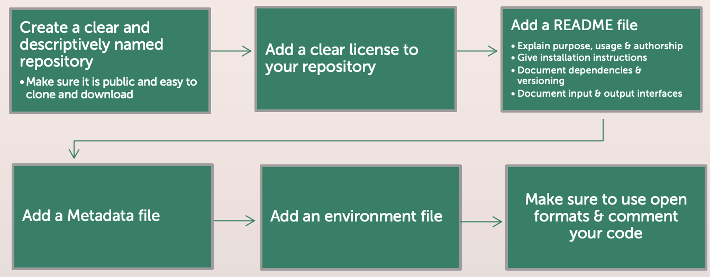

# FAIR software

Some of the principles and guidelines of FAIR software deviate from the ones for FAIR data. The following page gives you an overview over how to best make your software FAIR:

# The FAIR Software principles

## Findable
**Guideline:** Software, and its associated metadata, is easy for both humans and machines to find.

**This entails that...**

- ...your software is assigned a globally unique and persistent identifier
- ...your software is described with rich metadata.
- ...your metadata clearly and explicitly include the identifier of the software they describe.
- ...your metadata are FAIR, searchable and indexable.

**Leading question:** Is your software easy to locate and to identify?

## Accessible
**Guideline:** Software, and its metadata, is retrievable via standardised protocols.

**This entails that...**

- ...your software is retrievable by its identifier using a standardised communications protocol.
- ...your metadata are accessible, even when the software is no longer available.

**Leading question:** Can others obtain and run your software?

## Interoperable
**Guideline:** Software interoperates with other software by exchanging data and/or metadata, and/or through interaction via application programming interfaces (APIs), described through standards.

**This entails that...**

- ...your software reads, writes and exchanges data in a way that meets domain-relevant community standards.
- ... your software includes qualified references to other objects.

**Leading question:** Can your software work with other tools?

## Reusable
**Guideline:** Software is both usable (can be executed) and reusable (can be understood, modified, built upon, or incorporated into other software).

**This entails that...**

- ...your software is described with a plurality of accurate and relevant attributes.
- ...your software includes qualified references to other software.
- ... your software meets domain-relevant community standards.

**Leading question:** Can others understand and adapt your software?

# How can you implement the FAIR principles?

## Findable
- Use a public repository (e.g. GitHub)
- Write a clear README
- Add Metadata
- Assign a persistent identifier

## Accessible
- Host code in open repository
- Use open formats
- Include environment files
- Provide clear installation instructions

## Interoperable
- Use standard data formats and APIs
- Avoid hardcoding
- Containerize your software
- Document dependencies, input & output formats

## Reusable
- Add a license
- Provide usage examples
- Include metadata about author & version
- Write modular & well-documented code

# How can a possible workflow look like?

## How to: Create a repository using GitHub

- Create a GitHub account
- In the upper-right corner click on the ’+’ and then New repository
- Type in a clear, descriptive name for the repository
- Choose a visibility (private or public)
- Click Initialize this repository with a README
- Click Create repository

## How to: Add a license using GitHub

It is important to specify how others can use, modify, and share your software.
No license means that others can’t legally reuse your code

- Navigate to the main page of your repository
- Click Add file > Create new file
- Name the new file LICENSE
- Under the file name, click Choose a license template
- Choose a license
- Click review and submit and then commit the new changes 

## How to: Add a README file
- Look at [https://www.makeareadme.com](https://www.makeareadme.com)

## How to: Add a Metadata file with CodeMeta
- Look at [https://codemeta.github.io/create/](https://codemeta.github.io/create/)

## How to: Add an environment file

Using conda you can create an environment.yml which documents packages installed to the virtual environment
`conda env export --name old_env --from-history --file environment.yml`

If you want to use the environment.yml to create a new virtual environment use
`conda env create -f environment.yml`

You can also use pip to create a requirements.txt
`pip freeze > requirements.txt`

## How to: Make sure to use open formats & comment your code

Use widely supported file formats to ensure combability
CSV, JSON, XML

**NOT:** Proprietary file formats

Comment your code while you program!
Comments should not copy the code, but explain what is happening and why

# TLDR
**Follow the FAIR principle**

**Findable:** Use public repositories, add rich metadata, and assign persistent identifiers.

**Accessible:** Host code openly, use standard protocols, and provide installation instructions.

**Interoperable:** Use standard data formats and APIs, document dependencies, and (optionally) containerize your software.

**Reusable:** Add a license, write modular and well-documented code, and include metadata and usage examples.

**Example Workflow:** Create a public repository → Add README, license, metadata and environment file → Use open formats & comment your code

