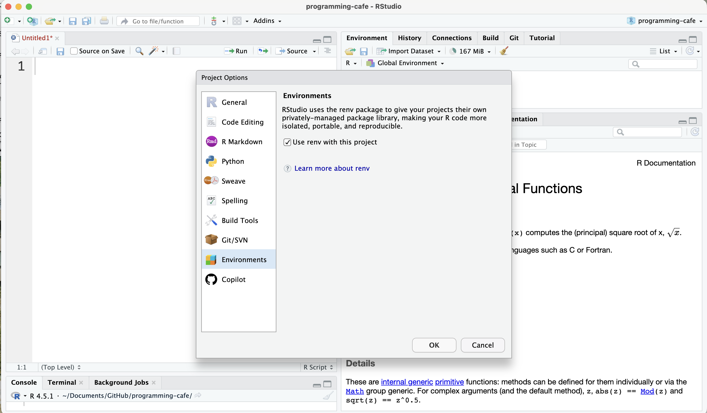
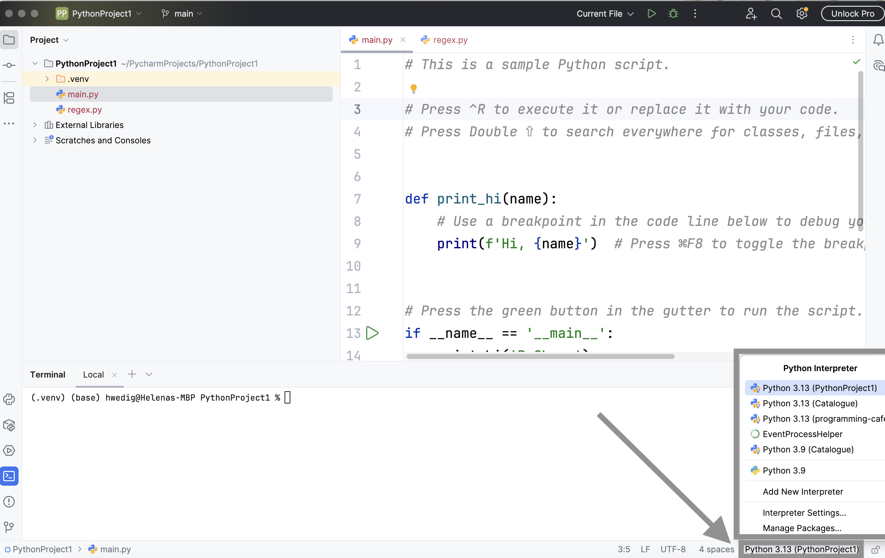
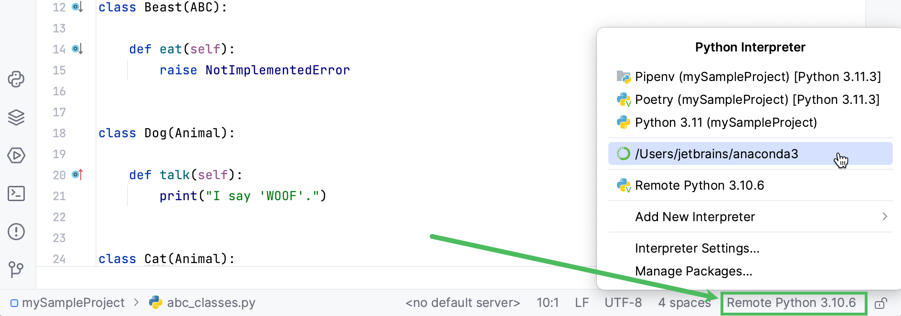
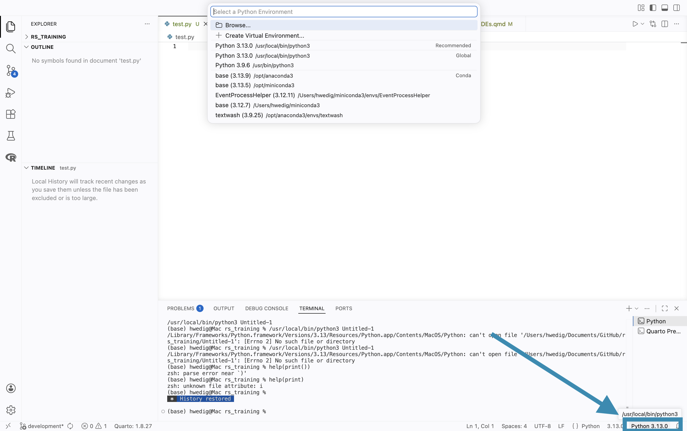
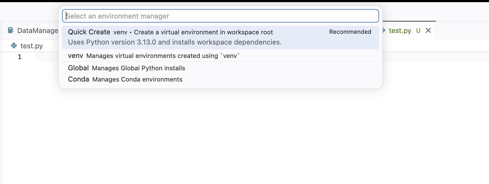

--- 
title: "IDEs and virtual environments" 
format: html 
toc: true 
toc-location: right 
--- 
While you might have used Integrated Development Environments (IDEs) such as PyCharm, RStudio and Visual Studio Code 
before to simply run your code, in this session, we want to explore more functionalities 
of the tools. To follow best practices, we loosely based the content on 
the lesson [Byte-sized RSE: Code Development & Debugging with IDEs](https://carpentries-incubator.github.io/byte-sized-rse-vscode/instructor/introduction.html) published in the Carpentries Incubator as well as the [lesson on Python and Visual Studio Code](https://train.rse.ox.ac.uk/material/HPCu/technology_and_tooling/ide/python) published in the Oxford University training platform. 
Please have a look at it, if you are interested in more examples. 
There is also a [podcast episode](https://codeforthought.buzzsprout.com/1326658/episodes/12051994-bytesized-rse-continuous-integration) by [Code for Thought](https://codeforthought.buzzsprout.com/1326658) on this topic.

Let us start with an introduction to IDEs:

## What is an IDE?
In its essence, an IDE is a graphical interface that offers you a workspace to write, edit, test, and debug code.
It is a modern approach to editors that are meant to ease your programming workflows.

Before modern IDEs, developers used text editors (you might have used one before) to write their code and then used other tools separately to run or debug the code.
These solutions were mostly not user-friendly, which is why modern IDEs were created. Many of them also support multiple programming languages.

### Why should I use an IDE?
An IDE is a one-stop shop for programming, it offers you everything you need in one place. Amongst other functionalities, **they help to...**

- **...format your code**. Most IDEs support automatic indentation (as well as other automatic code formatting) and syntax highlighting, which make your code more readable and consistent.

- **...auto-complete your code**. IDEs such as PyCharm and Visual Studio Code can suggest the next syntactically correct option, e.g., when you type the first few letters of a function.

- **...have a look at the documentation**. IDEs already show you a preview of the arguments needed when choosing a function, and they can also help you look up references.

- **...debug your code**. Did you make a mistake somewhere but can't figure out exactly what went wrong? IDEs offer functionalities that allow you to jump into the code and inspect how your variables change.

- **...run tests**. The IDEs can support you in running and managing tests of your code.

- **...view various file formats.** In their essence, IDEs also function as text editors, which means you can open many different file formats such as CSV, JSON, YAML, HTML, and TXT.

- **...use version control.** The IDEs support you in tracking changes to your code by enabling you to link them to version control systems such as Git.

- **...use virtual environments.** Most IDEs support you in creating virtual environments, allowing you to install packages and modules without changing the settings of your device.

- **...personalize your programming experience.** You can make most IDEs "your own". They offer extensions and settings which change appearance, usability and enable shortcuts.

### Which IDEs are popular and offered in the EUR Software Catalog?
The most common IDEs (which we will also have a look at today) are:

- **Visual Studio Code** (VS Code) 
  - supports various programming languages

- **PyCharm** (Community version)
  - mostly supports Python

- **RStudio**
  - mostly supports R

What might be also handy to know, but will not be explained today:

- **JupyterLab**

## Where can I find the IDEs?
### VSCode
<details>
<summary><b>EUR-managed PC</b></summary>

VSCode can be found in the software catalog and can be downloaded using the Company Portal  or [this link](https://liveeur.sharepoint.com/sites/EUR-Intune-Devices/Lists/Software%20catalog/DispForm.aspx?ID=98&e=rpdxSC).

</details>

<details>
<summary><b>Self-managed PC</b></summary>

Go to [this website](https://code.visualstudio.com) and download it for your operating system.

</details>

### PyCharm
<details>
<summary><b>EUR-managed PC</b></summary>

PyCharm can be found in the Software catalog of EUR. It can be downloaded using the Company Portal on the PC or via [this link](https://liveeur.sharepoint.com/sites/EUR-Intune-Devices/Lists/Software%20catalog/DispForm.aspx?ID=95).

</details>
<details>
<summary><b>Self-managed PC</b></summary>

Go to [this website](https://www.jetbrains.com/pycharm/?source=google&medium=cpc&campaign=emea_en_nl_pycharm_branded&term=pycharm&content=785237935124&gad_source=1&gad_campaignid=14124132615&gbraid=0AAAAADloJziVznVriVspxBSla4wIaOTpy&gclid=CjwKCAjwhLPOBhBiEiwA8_wJHGHI7R8d22KqXnkfaSiN92kHffQfBXZylcX0-UqacnLBOZB67AldMRoCEj4QAvD_BwE) and download the Community Edition for your operating system.

</details>

### RStudio
<details>
<summary><b>EUR-managed PC</b></summary>

RStudio can be found in the software catalog and can be downloaded using the Company Portal  or [this link](https://liveeur.sharepoint.com/sites/EUR-Intune-Devices/Lists/Software%20catalog/DispForm.aspx?ID=58&e=2akkHj).

</details>

<details>
<summary><b>Self-managed PC</b></summary>

Go to [this website](https://posit.co/products/open-source/rstudio/?sid=1) and download the Open Source Edition for your operating system.

</details>

---

At this point, I would like to show you how to use the various IDEs. For clarity, this will be split into three different subpages. **Please choose the IDE that you want to know more about and follow the material from that point on!**

---



---




---




---

# More than a feature: Virtual environments

Whenever we start a new programming project, it’s a good idea to create a matching virtual environment. You might wonder why this is necessary. A virtual environment makes it easier for you (and anyone else using your project) to reuse your work and maintain control over the exact package versions the project depends on.

In practice, using a virtual environment is like creating a small, isolated computer that contains its own programming language version (for example, Python 3.6) and its own set of package dependencies, independent from those on your actual machine. This prevents confusion about which package, which version, or even which programming language belongs to which project, keeping everything clean and organized.

A typical way to create a virtual environment directly in your machine terminal is using [conda](https://docs.conda.io/projects/conda/en/stable/user-guide/getting-started.html). After installing [conda](https://www.anaconda.com/docs/getting-started/miniconda/main) directly or via an [anaconda distribution](https://www.anaconda.com/docs/getting-started/anaconda/install/overview), creating a virtual environment is as easy as typing

```bash
conda create --name env-name
```

after that, you can activate the specific environment using 

```bash
conda activate env-name
```

and once activated, to install new packages you use 

```bash
conda install package-name
```

Aside form this use of conda in the terminal (or console), IDEs also have the option to create a virtual environment when you create a project. 

## Creating a virtual environment with RStudio

In RStudio, you can create a virtual environment using `renv`. To do that, you have to click on `Tools > Project Option > Environments` after that, you will see the following menu.


When you use renv for the first time, you will see the following message in your console:

```
renv: Project Environments for R

Welcome to renv! It looks like this is your first time using renv.
This is a one-time message, briefly describing some of renv's functionality.

renv will write to files within the active project folder, including:

  - A folder 'renv' in the project directory, and
  - A lockfile called 'renv.lock' in the project directory.

In particular, projects using renv will normally use a private, per-project R library, in which new packages will be installed. This project library is isolated from other R libraries on your system.

In addition, renv will update files within your project directory, including:

  - .gitignore
  - .Rbuildignore
  - .Rprofile

Finally, renv maintains a local cache of data on the filesystem, located at:

  - "~/Library/Caches/org.R-project.R/R/renv"

This path can be customized: please see the documentation in `?renv::paths`.

Please read the introduction vignette with `vignette("renv")` for more information.
You can browse the package documentation online at https://rstudio.github.io/renv/.
Do you want to proceed? [y/N]: 
```

Once you type in `y`, RStudio will create the environment and you can continue using RStudio like you are used to (i.e., using `install.packages()`). After installing a package and checking whether your code still works, you can use `renv::snapshot()` to log the package versions that you have, so that others can recreate your environment. You can find more information on how to use renv [here](https://rstudio.github.io/renv/articles/renv.html).

## Creating a virtual environment with PyCharm
In PyCharm, there are multiple ways to set up a virtual environment. The fastest way is to create it when creating a new project. To do this, click on `File > New Project...` and you will see the following window:



In this window, you can not only choose whether you want a project venv, base conda or custom environment, but also which Python version the environment should have. After creating the environment, you can install packages in the console of PyCharm using `pip` (or for conda environments using `conda`) as well as [the Python packages tool window](https://www.jetbrains.com/help/pycharm/installing-uninstalling-and-upgrading-packages.html#packages-tool-window). 

[Another way to create a virtual environment for an existing project](https://www.jetbrains.com/help/pycharm/creating-virtual-environment.html) is to click on the Python Interpretor selector (in the lower right corner) and either choose the interpreter (and venv) of choice or click on `Add Interpreter > Add Local Interpreter`. Afterward you will get a similar window as shown for the project creation.



To save the environment and to be able to share the packages (and versions) that you have, you can either follow [this guide](https://www.jetbrains.com/help/pycharm/managing-dependencies.html#add-requirements) or use `pip freeze > requirements.txt` in the console.

## Creating a virtual environment with VS Code

Similar to PyCharm, in VS Code you can [set and create your virtual environment](https://code.visualstudio.com/docs/python/environments#_creating-environments) using the environment editor in the lower right corner. After clicking on it, a menu will open under the search bar, where you can either choose an existing environment or create your own venv.



Once you click on `+ Create new Virtual Environment...` the following options will be shown:



You can choose the environment that fits your needs here. 

After creating the venv, you can use the VS Code terminal to install new packages.

To save the environment and to be able to share the packages (and versions) that you have, you can use `pip freeze > requirements.txt` in the terminal.
