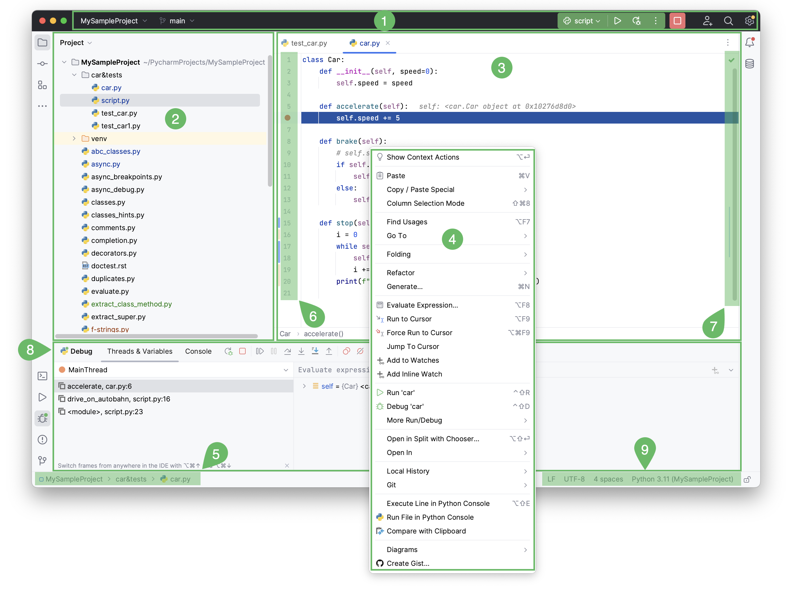
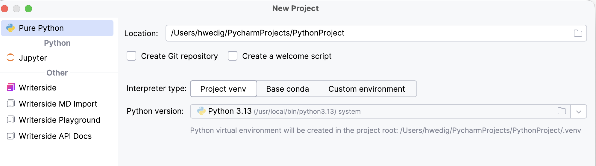
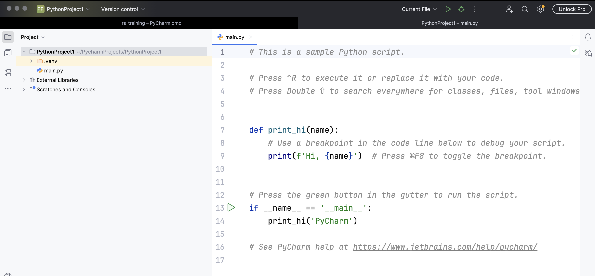
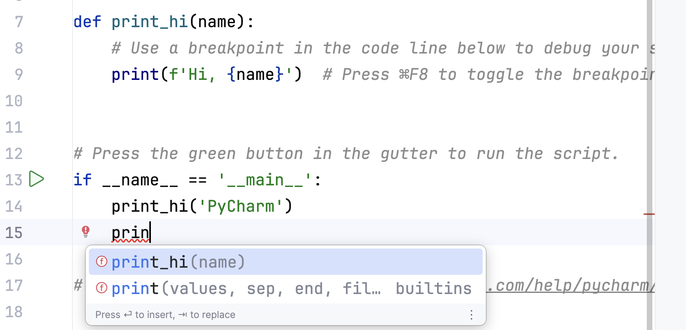
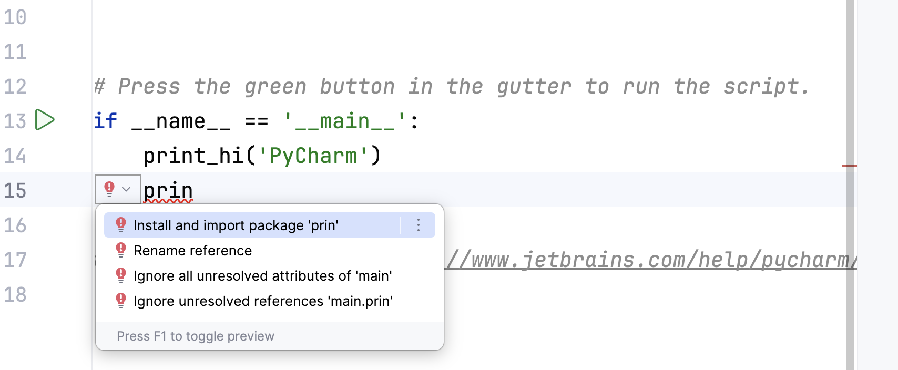
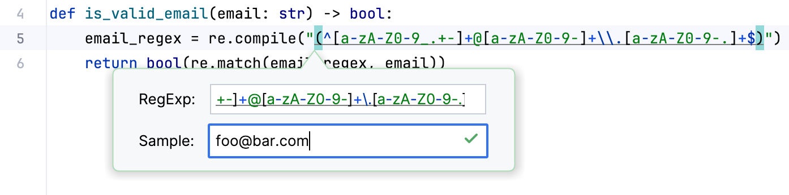
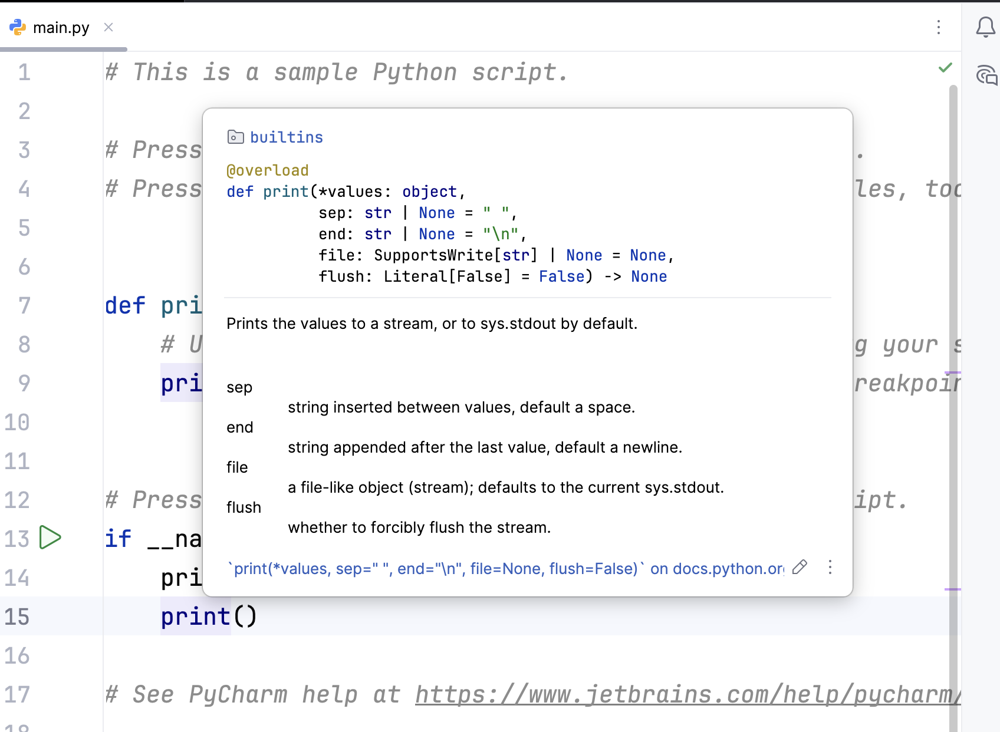
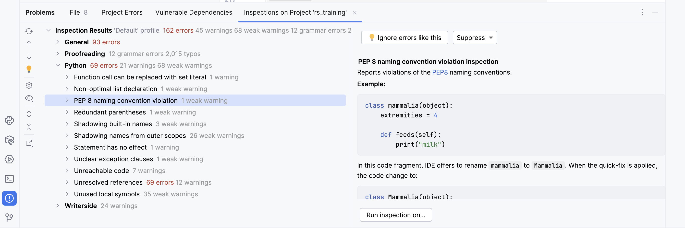
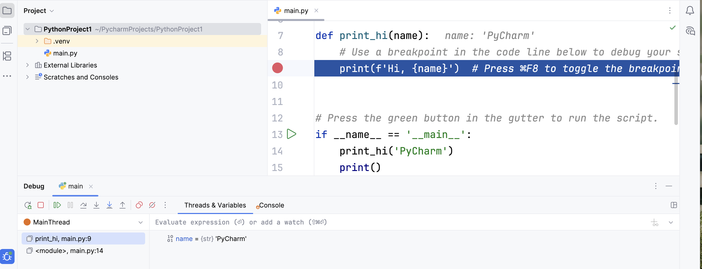

# Get to know PyCharm
The following overview is based on the [PyCharm User Guide](https://www.jetbrains.com/help/pycharm/quick-start-guide.html) and also contains screenshots taken from that website. It has been shortened to mostly show relevant content.

## A quick tour through your IDE

The interface of PyCharm shows you nine different elements. 

- The window header (1) contains buttons that allow easy access to import functions such as running the code.
- The project tool window (2) shows the folder structure. It can be used to navigate between files.
- The editor (3) allows you to edit your Python scripts and switch between open files using the tabs.
- When you right-click, the context menus (4) open. They are a handy way to easily access functions e.g., refactoring a file. 
- The navigation bar (5) shows you where you are right now and allows you to switch to your parent folders.
- The gutter (6) shows you in which line of code you are working and allows you to set breakpoints to debug your code.
- The scrollbar (7) gives you hints and notification about your code e.g., about style issues or potential errors.
- The tool windows (8) allow you to access the console and the debugger. 
- The status bar (9) shows you the file formatting, some warnings and the virtual environment that you are in.

## How do I run simple code?
You can run simple code by writing it in the console, 
but it is recommended to create a project first and then write your code in a Python script to run it. 

To [create a project](https://www.jetbrains.com/help/pycharm/creating-empty-project.html), you click on `File>New Project` then choose `Pure Python` and choose your project location.
After that, you can also choose the Python version that you will be working with. You can also decide here whether a Git repository should be set up

If you click `Create a main.py welcome script` PyCharm adds the main.py file to your project.

After writing your code, you can click on the play button in the upper left corner [to run your code](https://www.jetbrains.com/help/pycharm/running-without-any-previous-configuring.html)!

## Get to know the basic features

### Identation & Syntax Highlighting
PyCharm [automatically indents](https://www.jetbrains.com/help/pycharm/indentation.html) your code according to the programming language that you chose. The status bar (9) shows you the setting e.g., 4 spaces.

Aside from automatically indenting your code, PyCharm also [highlights keywords, comments, parameters, type hints, and other elements.](https://www.jetbrains.com/help/pycharm/python-code-insight.html) as you can see in the example for the welcome script!

### Autocompletion
PyCharm helps you to complete the names of classes, methods, and keywords within your project.
By default, it displays the [code completion](https://www.jetbrains.com/help/pycharm/auto-completing-code.html) automatically as you type. You can choose which suggestion to accept by using the arrow keys and `Enter`.

### Intentions
PyCharm can give you [various tips](https://www.jetbrains.com/help/pycharm/python-code-insight.html#intentions) while you program.
These suggestions and/or tips will be shown with a light bulb.

### Checking regular expressions
If you work with [regular expressions](https://www.jetbrains.com/help/pycharm/python-code-insight.html#regex), PyCharm can help you check whether your string matches your expression. To do that, you can click `Option` and `Enter` when your mouse is above the regular expression.

### Viewing reference documentation

If you want to look up certain functions, you can press `F1` while your mouse is on the function name. PyCharm will give you an [insight into the documentation](https://www.jetbrains.com/help/pycharm/python-code-insight.html#ref-doc) then.

### Optimize your code
PyCharm can [inspect your code](https://www.jetbrains.com/help/pycharm/code-inspection.html) according to style guidelines. To use this very handy function, click on `Code` and then on `Inspect code...`.

Inspecting the code will lead PyCharm to detect and correct problems with your code. It looks for dead code (i.e., that is not used), find potential bugs, spelling errors and improve your style (e.g., code structure).

After clicking on the corresponding item, PyCharm will suggest you possible changes or improvements.

### Debugging
PyCharm can help you [debug your code](https://www.jetbrains.com/help/pycharm/debugging-code.html) and find out the status of your variables within the process. To use that feature, you can make use of so-called break points.
Breakpoints can be set in the gutter and lead PyCharm to stop the process at that point. 

After setting the breakpoints, a click on the small bug in the right upper corner leads the program to run and the debugger to start. After stopping, the debug window will open and allow you to step over, in or continue the process.

### Version control
Your IDE can [connect to a version control](https://www.jetbrains.com/help/pycharm/version-control-integration.html) of your choice.

The easiest way to use Git is to directly [set up the connection](https://www.jetbrains.com/help/pycharm/working-with-git-tutorial.html#create-test-prj) at the beginning of the project. To do that, you can flag the option `Create Git repository` when creating the project.

After setting up Git, PyCharm can visualise your changes and allows you to `commit` and `push` directly from the IDE.

For more information, you can have a look at the PyCharm documentation [here](https://www.jetbrains.com/help/pycharm/working-with-git-tutorial.html) or follow one of our upcoming sessions on version control!

### Personalize your experience
PyCharm offers various [plugins](https://www.jetbrains.com/help/pycharm/managing-plugins.html) and [themes](https://www.jetbrains.com/help/pycharm/user-interface-themes.html) to personalize your IDE.

You can find an overview of all plugins [here](https://plugins.jetbrains.com/pycharm). Funny enough, you can even replace your progress bar with random Pokémon using the [Pokémon progress](https://plugins.jetbrains.com/plugin/15090-pokemon-progress) plugin.

You can also customize [the colour scheme and fonts](https://www.jetbrains.com/help/pycharm/configuring-colors-and-fonts.html).

## Link your IDE with SURF tools
You can also use PyCharm for remote development (e.g., with a SURF product). SURF provides a good tutorial [here](https://servicedesk.surf.nl/wiki/spaces/WIKI/pages/30668881/PyCharm+and+other+JetBrains+IDEs+for+remote+development).

## More documentation