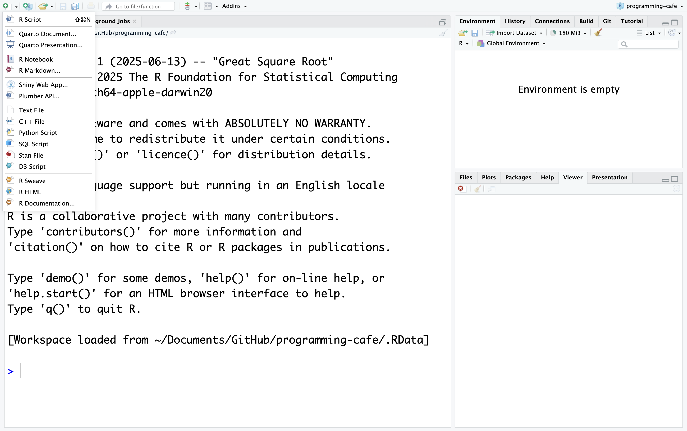
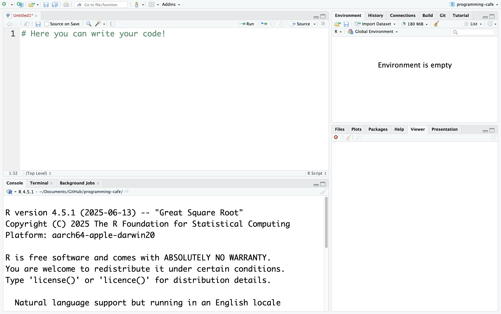
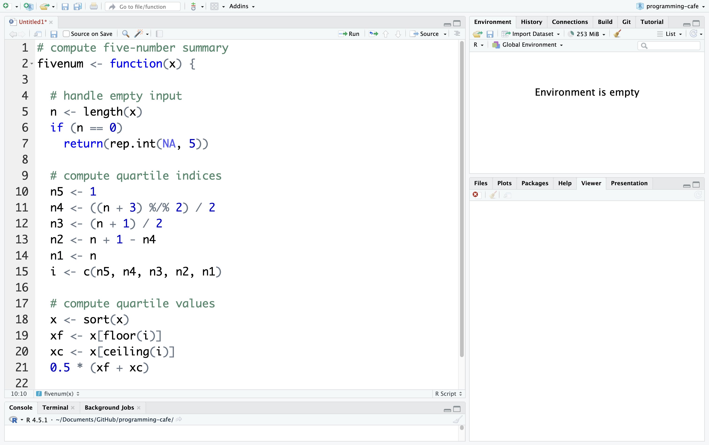
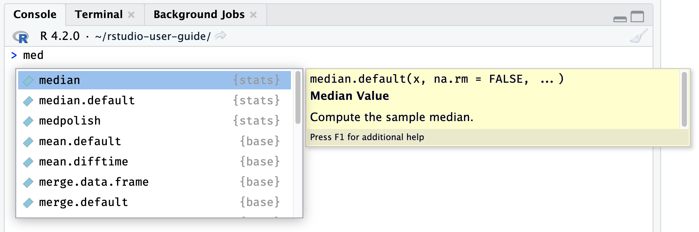
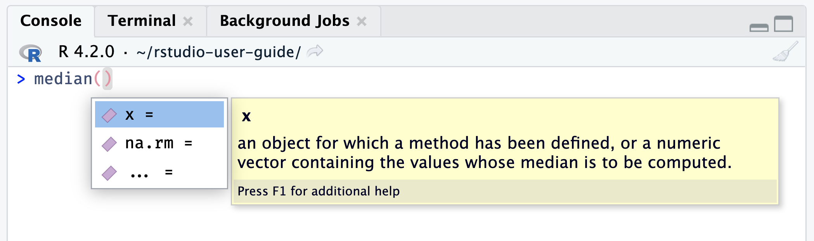
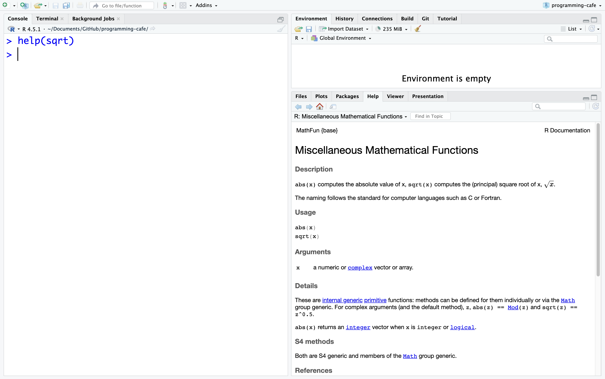
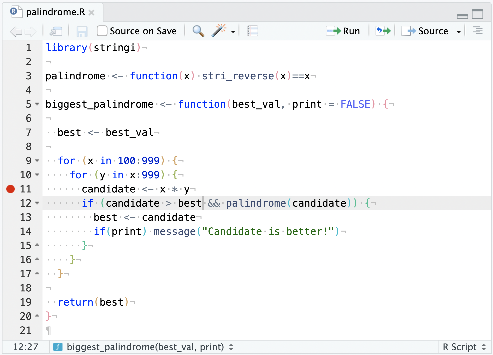
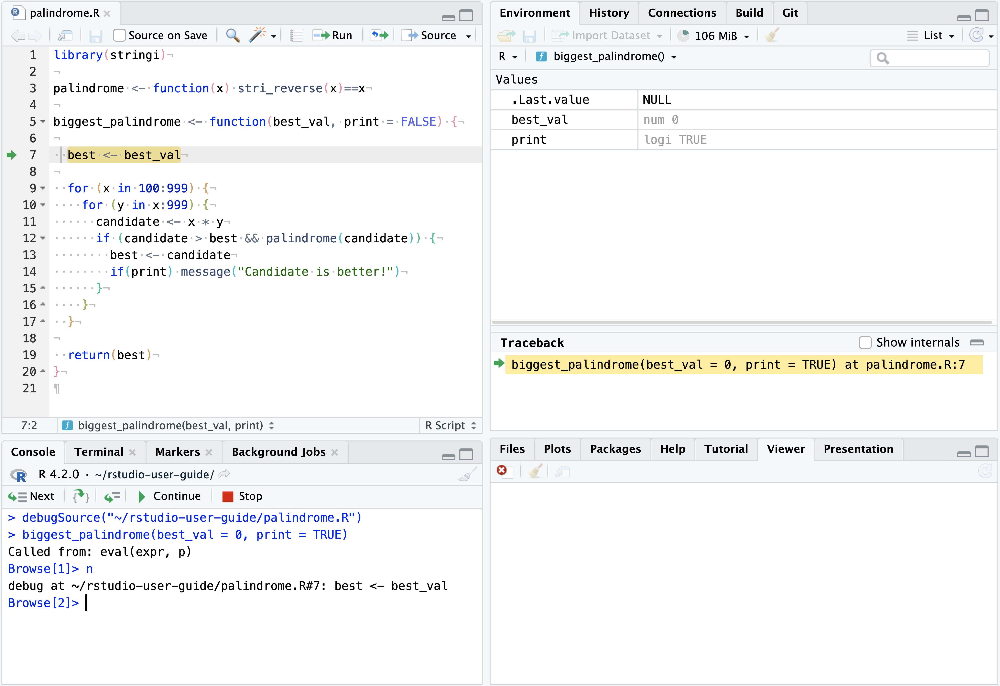
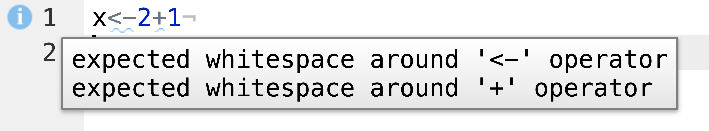
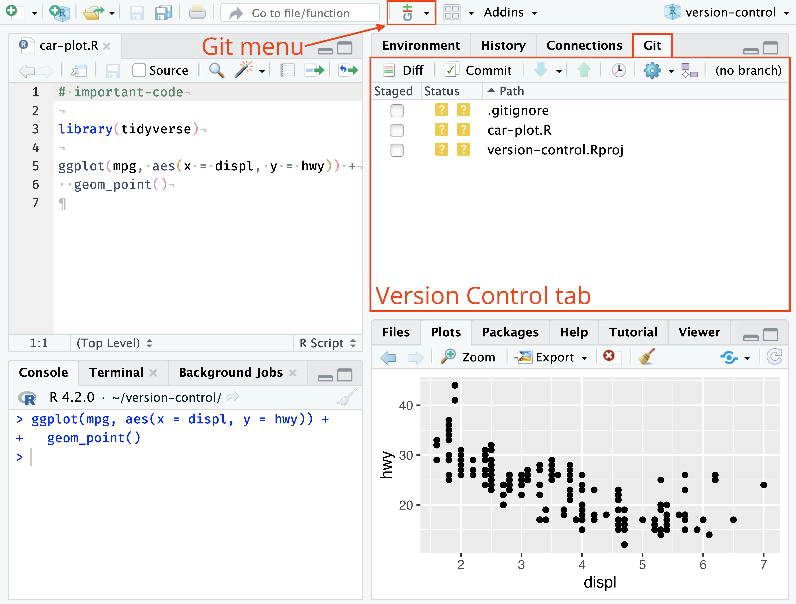

# Get to know RStudio
Do you want to be more efficient when using RStudio? 
The following overview is based on the [RStudio User Guide](https://docs.posit.co/ide/user/ide/get-started/) and also contains screenshots taken from that website. It has been shortened to mostly show relevant content.
## A quick tour through your IDE

The interface of RStudio shows you four so-called "panes". 
- The Source pane (1) allows you to edit your R scripts.
- The Console pane (2) can be used to write short R commands that do not need to be listed in the script (e.g., help() or view() to access more information).
- The Environment pane (3) shows your environment, that means, the objects that you created.
- The Output pane (4) shows your plots, tables or html files.

As you can already see in the screenshot, the four panes have multiple functions. In the Output pane, for example, you can also manage your packages, look at the documentation or see your folder structure.

## How do I run simple code?
To run simple code, you can just use the Console pane. However, to actually perform analyses, we recommend that you [create a new Project](https://docs.posit.co/ide/user/ide/guide/code/projects.html). 
To do that, click on `File > New Project` and choose your working directory. 

After that, you can click on the green plus in the upper left corner to [create an empty .R script](https://docs.posit.co/ide/user/ide/guide/ui/files.html). 

In this document, you can write all your code! Do not forget to save it in your working directory!

## Get to know the basic features
### Smart indentation & syntax highlighting
While writing your own code, R highlights some important expressions in blue as well as comments in green and also helps you to manage your indentation, for example, when writing a function. The following screenshot shows an example:

### Autocompletion
RStudio can help you with writing your code by offering [automatic completion](https://docs.posit.co/ide/user/ide/guide/code/console.html) using the `Tab` key. It automatically completes object names, function names and even possible arguments.

Here you can see an example of function completion:

and here an example of argument completion:

### Documentation
Within R, you can have a quick look into the documentation by using the [`help()`function or using `?`](https://www.r-project.org/help.html). The documentation will then be opened in the Output pane.

In the following screenshot you can see the documentation of the `sqrt()`function:

### Debugging

If you encounter a bug and want to find out, what the reason could be, you might want to use [debugging](https://docs.posit.co/ide/user/ide/guide/code/debugging.html). 
To do that, you need to tell R when you want to look into the status of your program. 
You can do that by setting breakpoints with a left click next to your code (on the index (left)).

Once your program reaches the breakpoint, it will stop and give you the insights that you wanted.

If you are interested in how to debug, please have a look at the [RStudio documentation](https://docs.posit.co/ide/user/ide/guide/code/debugging.html). We hope to offer a Programming Café session on it in the future!

### Code Diagnostics
RStudio can have a look at your code for you to find potential errors and stylistic issues! You can activate the function in the settings `Settings`>`Code`>`Diagnostics`.

Turning the diagnostics on, you will see the potential problems. The screenshot belows shows an example of a stylistic issue. R Studio offers a good overview of all potential messages [here](https://docs.posit.co/ide/user/ide/guide/code/diagnostics.html).

### Version control
It is possible to connect R Studio with Git and Subversion. To do that, you can go to `Settings`>`GIT/SVN` and then enable the version control.
Once you enabled it, you will find a Git tab in the environment pane which shows you the current changes. It also allows you to `commit`, `push` and `pull` using the Git dropdown.

If you want to know more about version control, consider following one of our Git courses or have a look at the [RStudio documentation](https://docs.posit.co/ide/user/ide/guide/tools/version-control.html).

### Personalize your experience
While the first thought that comes to mind when thinking about prsonalizing an IDE is adapting the color scheme, RStudio also offers various [other customizing options](https://support.posit.co/hc/en-us/articles/200549016-Customizing-the-RStudio-IDE). 

Amongst others, you can
- [enable/disable line numbers](https://support.posit.co/hc/en-us/articles/200549016-Customizing-the-RStudio-IDE#editing)
- [highlight selected words and lines](https://support.posit.co/hc/en-us/articles/200549016-Customizing-the-RStudio-IDE#editing)
- [change the font size](https://support.posit.co/hc/en-us/articles/200549016-Customizing-the-RStudio-IDE#appearance)
- [customize the panes](https://support.posit.co/hc/en-us/articles/200549016-Customizing-the-RStudio-IDE#pane-layout)
- [use spell checking](https://support.posit.co/hc/en-us/articles/200549016-Customizing-the-RStudio-IDE#spelling)
- [change the theme](https://support.posit.co/hc/en-us/articles/115011846747-Using-Themes-in-the-RStudio-IDE)

## More documentation