# Get to know VS Code

The following overview is based on the [Visual Studio Code Documentation](https://code.visualstudio.com/docs) as well as [the Carpentry lesson on IDEs](https://carpentries-incubator.github.io/byte-sized-rse-vscode/index.html). The content has been shortened to mostly show relevant content.

## A quick tour through your IDE

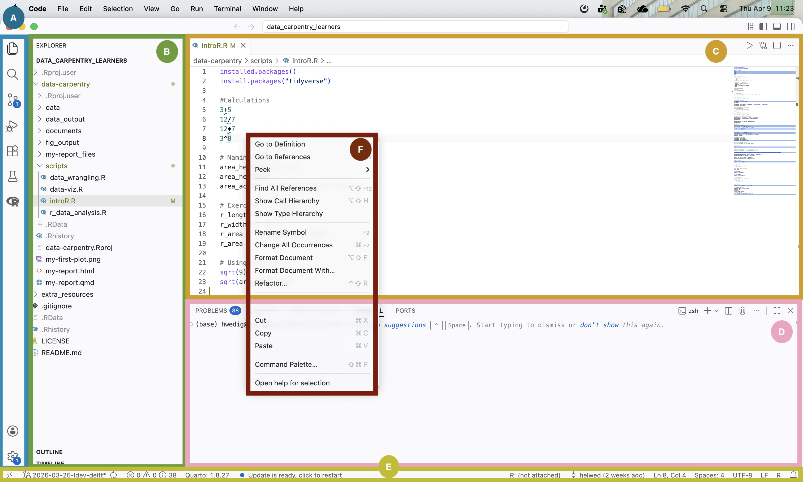

Visual Studio Code is divided into [six main areas](https://code.visualstudio.com/docs/getstarted/getting-started):

-   **Activity Bar (A)**: this bar on the left gives you fast access to context-specific indicators, e.g., Git, run your code, search for files and look for extensions.
-   **Primary Side Bar (B)**: this bar contains your file structure, the outline and timeline of your project.
-   **The Editor groups (C)**: here you can edit your scripts and other files.
-   **The Panel (D)**: this area shows the output, debug information, errors and warnings, and gives you access to an integrated terminal
-   **The Status Bar (E)**: this bar shows you information about the opened project and the files you edit.
- **The Contextual Edit Menu (F)**: this menu opens when you right-click. It shows you contextual options.

## How do I run simple code?

To run simple code, you just use the terminal access in the panel. However, to write your own scripts, we recommend that you create a folder locally and then open it with VS Code using `File > Open Folder`.

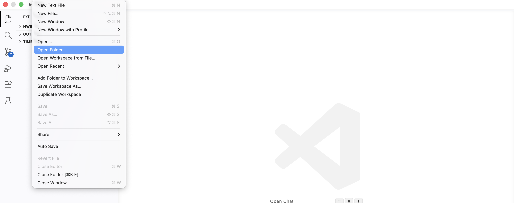

After opening the folder, you can click on `File > New File...` to create a new script of your choice. After typing in the file name with the right file format (e.g., .py) a new script opens in the editor fields.

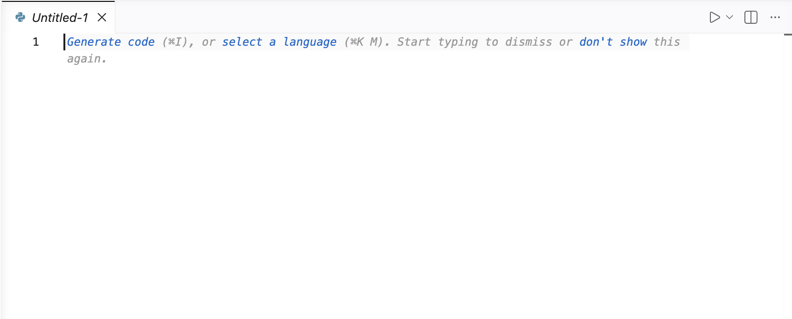

In this document, you can write all your code! Do not forget to save it!

**Attention! To run Python or R code, you need to install [the Python](https://marketplace.visualstudio.com/items?itemName=ms-python.python) or [R extensions](https://marketplace.visualstudio.com/items?itemName=REditorSupport.r). These extensions give you more language-specific content such as documented [here](https://code.visualstudio.com/docs/python/python-tutorial) for Python and [here](https://code.visualstudio.com/docs/languages/r) for R.**

## Get to know the basic features

### Indentation & Syntax Highlighting

Similar to other IDEs VS Code highlights your syntax according to the programming language that you chose. The following example shows the coloring of a Python script:

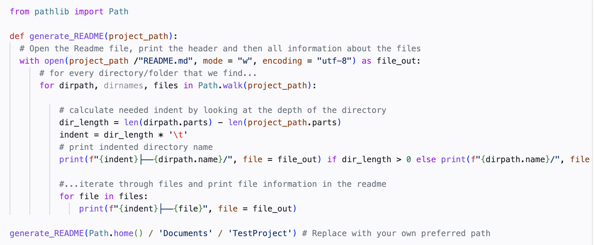

You can see that functions are colored purple, in-built words are pink and function arguments are colored orange. You can adjust these colors using `Code > Settings > Themes`.

In addition to syntax highlighting, VS Code supports text indentation and automatically adjusts the indentation level based on the syntax (e.g., when writing a function).

### Code Formatting

You can use VS Code's built-in support to format your code. To access this feature, right-click within the document you want to format to open the contextual edit menu. Once opened, the following menu will appear:

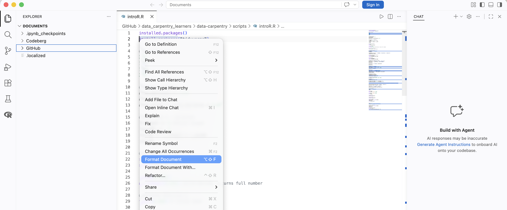

By clicking on `Format Document`, elements such as indentations, whitespaces, and empty lines will be adjusted to follow a unified style.

### Autocompletion

VS Code offers the [IntelliSense](https://code.visualstudio.com/docs/editing/intellisense) feature, which includes functionalities such as code autocompletion.

IntelliSense in VS Code relies on a language service, which uses an understanding of the language's rules and an analysis of your source code to provide intelligent code suggestions. When the language service identifies possible completions, these suggestions will appear automatically as you type.

The following example shows an example of an R script:

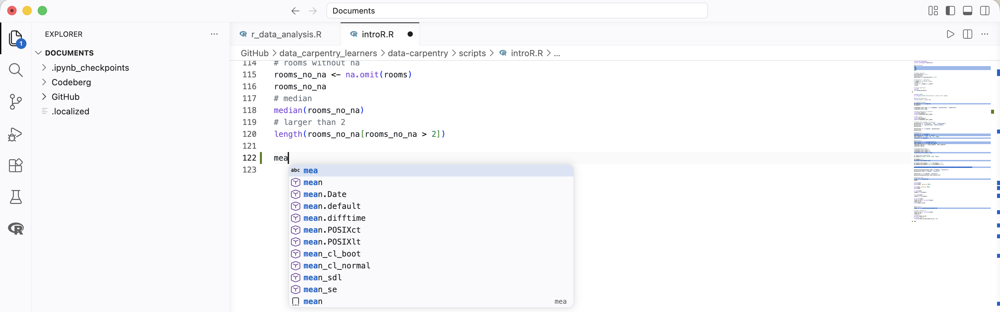

### Documentation

Like many other IDEs, VS Code displays a preview of the code documentation when you hover over a particular function.

Example R:
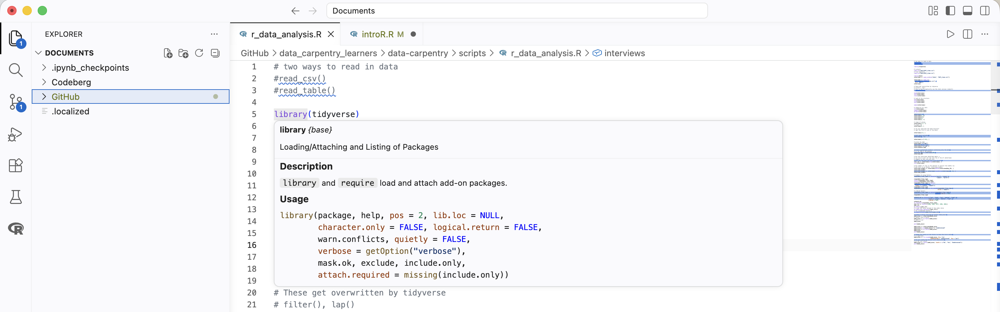

Example Python:
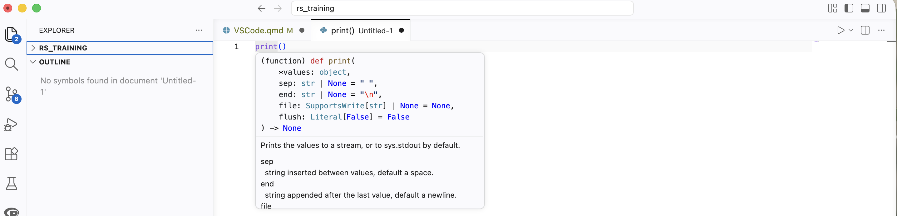

For R, you can also open the specific help for a selection with the help of the contextual edit menu and a click on `Open help for selection`.

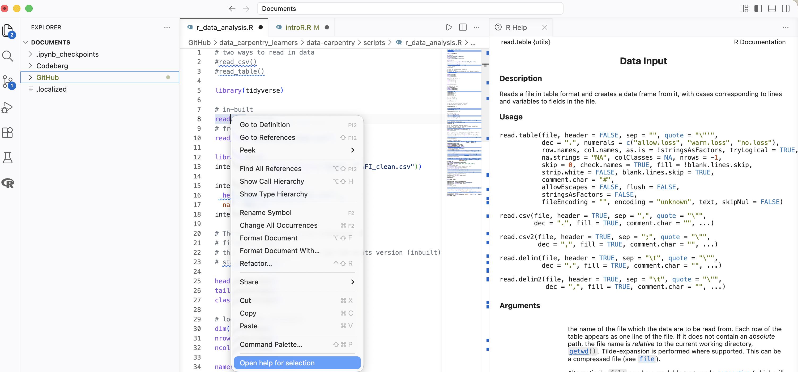

### Debugging

VS Code allows you to [debug your program](https://code.visualstudio.com/docs/debugtest/debugging), meaning you can analyze its behavior while it runs. To enable debugging, you'll need to install a relevant debugging extension for your programming language from the Visual Studio Marketplace. Afterward, you may need to set up a [debugging configuration](https://code.visualstudio.com/docs/debugtest/debugging-configuration) for your project. Once you click `Run > Start Debugging`, Visual Studio Code will guide you through the setup process.

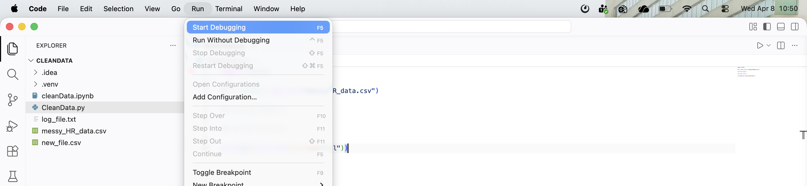

After everything is configured, you can place breakpoints on the left margin of your code.

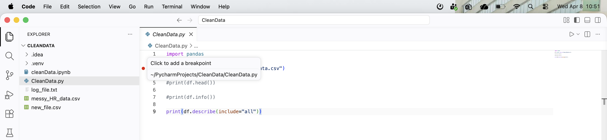

Once the debugging process begins, new windows will appear in your editor, providing insights into your code.

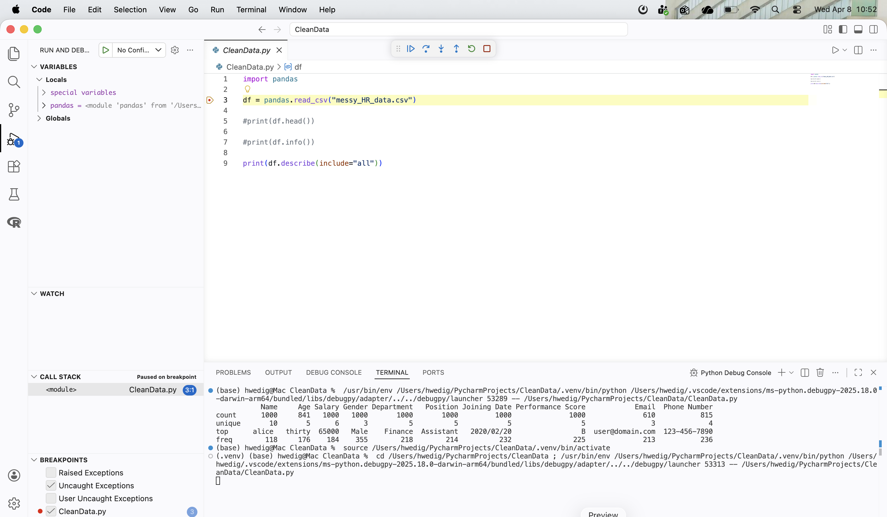

### Version control

VS Code allows you to connect with your Git repositories and manage your [version control](https://code.visualstudio.com/docs/sourcecontrol/overview) with the IDE.

By clicking on the third button in the activity sidebar, you will see an overview of all changes and the history of your Git repository. Additionally, you can compare the current version with the uploaded version, as demonstrated in the example below.

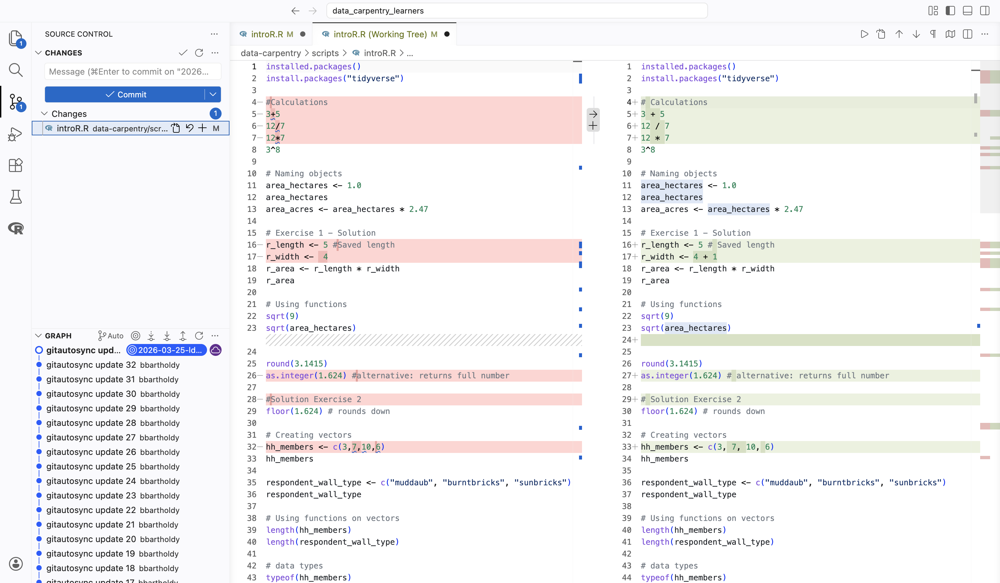

For more information about Git & GitHub, please follow one of our upcoming courses!

### Personalize your experience

VS Code is one of the most customizable IDEs. You can not only adapt the [theme](https://code.visualstudio.com/docs/configure/themes) and [layout](https://code.visualstudio.com/docs/configure/custom-layout), but your whole programming experience using [the extensions](https://code.visualstudio.com/docs/getstarted/extensions) and [the settings](https://code.visualstudio.com/docs/configure/settings).

[This website](https://code.visualstudio.com/docs/getstarted/personalize-VS Code) gives a nice overview of the most basic options. You can also find an overview of how to make it more accessible [here](https://code.visualstudio.com/docs/configure/accessibility/accessibility).

## Link your IDE with SURF tools
You can also use VS Code for remote development (e.g., with a SURF product). SURF provides a tutorial [here](https://servicedesk.surf.nl/wiki/spaces/WIKI/pages/30660616/Visual+Studio+Code+for+remote+development).

## Further reading
- VS Code offers cheat sheets for [Windows](https://code.visualstudio.com/shortcuts/keyboard-shortcuts-windows.pdf), [macOS](https://code.visualstudio.com/shortcuts/keyboard-shortcuts-macos.pdf) and [Linux](https://code.visualstudio.com/shortcuts/keyboard-shortcuts-linux.pdf).

- You can find a tutorial on Data Science with VS Code [on their website](https://code.visualstudio.com/docs/datascience/data-science-tutorial).

- It is possible to [combine jupyter notebooks with VS Code](https://code.visualstudio.com/docs/datascience/jupyter-notebooks).

- VS Code provides an [overview of tips and tricks here](https://code.visualstudio.com/docs/getstarted/tips-and-tricks).