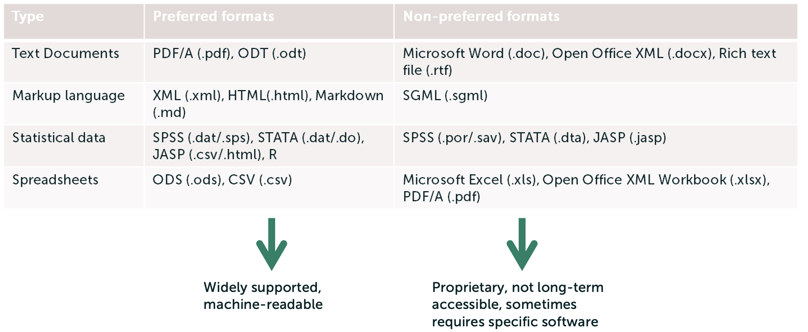
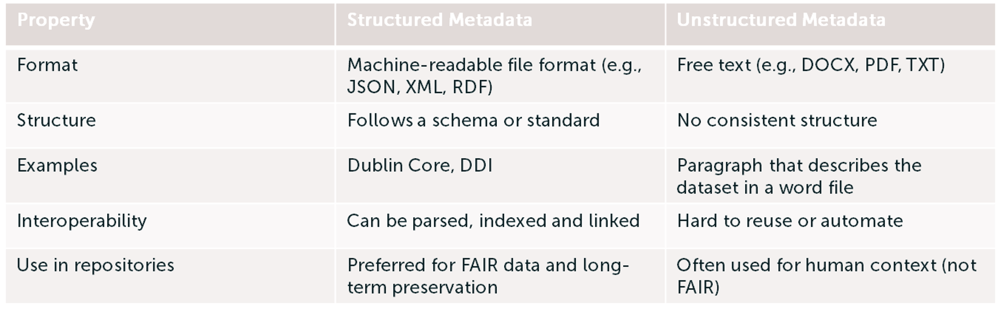
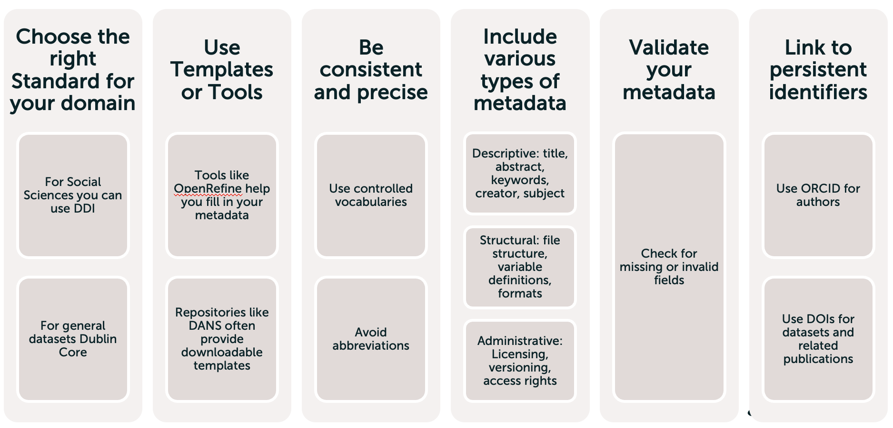
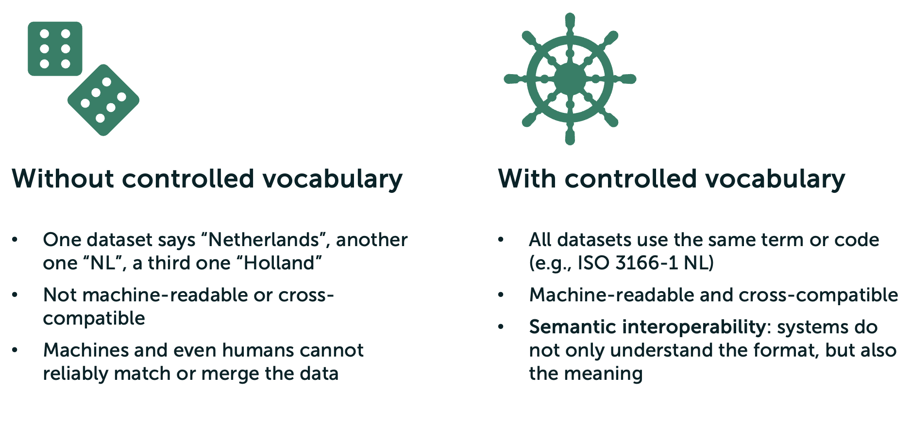
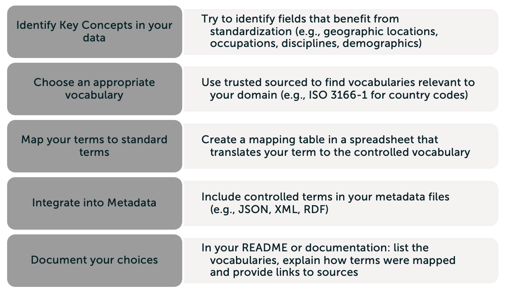
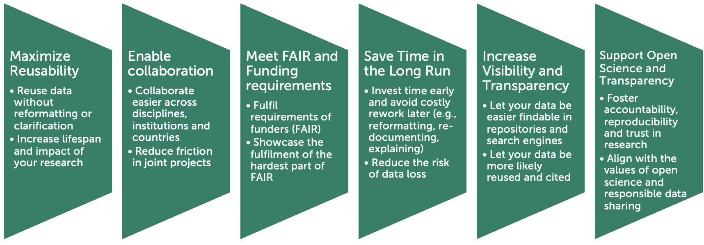

# Understanding Interoperability
The most confusing principle of FAIR is interoperability. You might wonder how that can help you in your project or your research. Have a look at the following small clip to see what it can entail!



Did you see that the researchers were not able to exchange their data? To already consider interoperability in the beginning of a project, can prevent such situations in the future (e.g., when someone wants to reuse your data). Making your data interoperable is easier than it sounds! Let's have a look at some possible changes together.

# But first, what is interoperability?

In the context of FAIR, **interoperability** means that data and software can be **integrated, exchanged** and **reused** across systems, disciplines and research software **without needing extensive reformatting** or translation. We usually differentially between Data and Software interoperability.

**Data interoperability**
Mainly answers the question whether your data can be understood and used by others and machines without ambiguity?

**Software interoperability**
Answers the question whether your script can work with others’ systems, libraries or research software?

The fastest way to make your data and/or software interoperable is to use **standards**. Standards are agreed-upon rules for how data and software should be structured, described and exchanged. Categories in which standards play a role are...

...file formats\
...metadata schemas\
...controlled vocabularies\
...APIs and protocols

We will have a look at three standards: file formats, metadata schemas and controlled vocabularies.

# File formats

Choosing the right file format helps to let your data…
 
…be understood and read by different software\
…shared and reused easily\
…preserved and accessed over time without any problem

Examples of preferred file formats can be found on the [DANS website](https://dans.knaw.nl/en/file-formats/), but here you can find a short overview:

# Metadata standards
Metadata is often described as ‘data about data’

In terms of interoperability, it is important that the metadata…

…uses shared standards (e.g. Dublin Core)\
…is machine-readable and human-understandable\
…can be exchanged and interpreted across research software\

In general, we differentiate between structured and unstructured metadata. Structured metadata is preferred when thinking about interoperability, but you can find a small comparison here:

If you are looking for the right metadata standard, visiting these websites can help you:

- [List of metadata standards DCC UK](https://www.dcc.ac.uk/guidance/standards/metadata/list?page=1)
- [Metadata Standards Catalog](https://rdamsc.bath.ac.uk)
- [DDI for social, behavioural and economic sciences](https://ddialliance.org)
- [Domain-agnostic metadata schema Dublin Core](https://www.dublincore.org/specifications/dublin-core/)

This overview shows an overview of practical tips how to use metadata standards in your research:

# Controlled Vocabularies
The third type of standard that we recommend to have a look at are controlled vocabularies, curated lists of terms that are...\
... standardized, that is, everyone uses the same term for the same concept\
...defined, that is, each term has a clear, agreed-upon meaning,\
...and hierarchical or linked, that is, terms may be related (e.g., broader or narrower concepts are available). \

Examples for controlled vocabularies are [ISO 3166-1](https://www.iso.org/iso-3166-country-codes.html), [ESCO](https://op.europa.eu/en/web/eu-vocabularies/esco) and the [UNESCO Thesaurus](https://vocabularies.unesco.org/en/).  

You might wonder, why we need controlled vocabularies. The following overview shows a short comparison that shows you, why we recommend controlled vocabularies.

You can find an overview on how to best approach controlled vocabularies here:

# Why do we want to invest our time to ensure our data is interoperable?

Now, these were the three standards that we wanted to introduce to help you make your data more interoperable. But you might wonder now, why you should invest your time?

# Resources and further reading
- [FAIR data principles — UK Data Service](https://ukdataservice.ac.uk/learning-hub/research-data-management/plan-to-share/fair-data-principles/?OR=OfficeMobile)
- [The FAIR Guiding Principles for scientific data management and stewardship – Scientific Data](https://www.nature.com/articles/sdata201618) 
- [FAIR-Aware](https://fairaware.dans.knaw.nl/)
- [The FAIR Principles - A Short Guide for Researchers | LOGS](https://logs.sciy.com/fair-data/the-fair-principles-a-short-guide-for-researchers.html?OR=OfficeMobile)
- [Best Practices & FAIR data - Research Data Management](https://library-guides.ucl.ac.uk/research-data-management/best-practices-fair-data) 
- [FAIR principles open science | Erasmus University Rotterdam](https://www.eur.nl/en/research/research-services/research-data-management/fair-principes-open-science)
- [How to make your data FAIR](https://www.openaire.eu/how-to-make-your-data-fair)
- [PARTHENOS Guidelines to FAIRify data management and make data reusable](https://zenodo.org/records/3368858)
- [FAIR Principles - GO FAIR](https://www.go-fair.org/fair-principles/)

# TLDR
- To ensure interoperability, take file formats, metadata standards and controlled vocabularies into account
- It is best to use a file format which allows long-term access and is machine-readable and human-readable
- Metadata is the data about the data and entails the use of metadata standards such as Dublin Core
- Metadata should be machine-readable and human-readable
- Controlled vocabularies are a curated list of terms that are standardized, defined and hierarchical or linked (such as ISO 3166-1)
- Controlled vocabularies allow the data to be semantic interoperable: the system does not only understand the structure, but also the meaning
